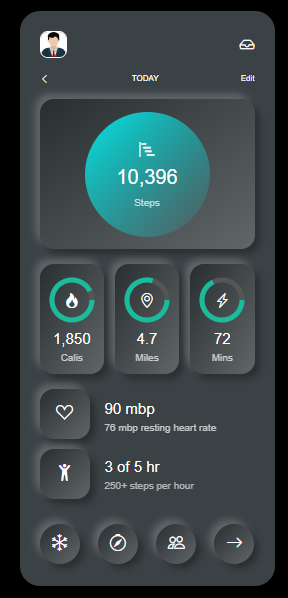

# mobile_fun_ui

This project is a mobile-friendly user interface designed using HTML, CSS, JavaScript, and React JS. The UI includes various fitness tracking features such as step count, calories burned, miles walked, active minutes, and heart rate monitoring.

## Features

- **Steps Tracking**: Displays the number of steps taken.
- **Calories Burned**: Shows the number of calories burned.
- **Distance Covered**: Indicates the miles walked.
- **Active Minutes**: Displays the total active minutes.
- **Heart Rate Monitoring**: Shows the current heart rate and resting heart rate.
- **Hourly Activity**: Tracks activity per hour.

## Screenshot



## Getting Started

### Prerequisites

Ensure you have the following installed:

- Node.js
- npm (Node Package Manager)

### Installation

1. Clone the repository:

   ```bash
   git clone https://github.com/anwaarshah/mobile_fun_ui.git
   ```

2. Navigate to the project directory:

   ```bash
   cd mobile_fun_ui
   ```

3. Install the dependencies:

   ```bash
   npm install
   ```

### Running the Application

To start the development server, run:

```bash
npm start
```

The application will open in your default web browser. If it doesn't, navigate to [http://localhost:3000](http://localhost:3000).

## Built With

- [React JS](https://reactjs.org/)
- HTML
- CSS
- JavaScript

## Contributing

Contributions are welcome! Please fork this repository and submit a pull request.

1. Fork the Project
2. Create your Feature Branch (`git checkout -b feature/YourFeature`)
3. Commit your Changes (`git commit -m 'Add some feature'`)
4. Push to the Branch (`git push origin feature/YourFeature`)
5. Open a Pull Request

## License

Distributed under the MIT License. See `LICENSE` for more information.

## Contact

Anwaar Shah - [anwaarshah194@gmail.com](mailto:anwaarshah194@gmail.com)

Project Link: [https://github.com/anwaarshah313/mobile_fun_ui](https://github.com/anwaarshah313/mobile_fun_ui)
